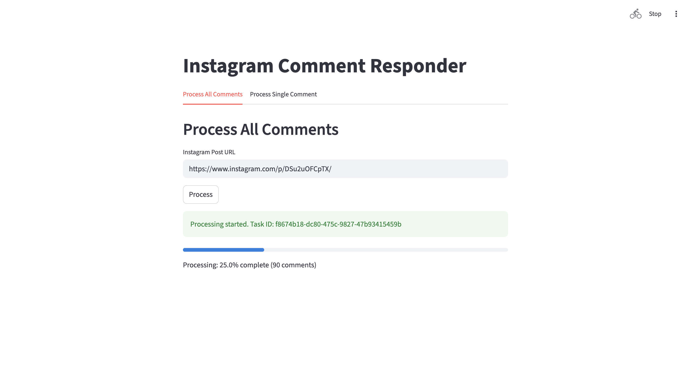
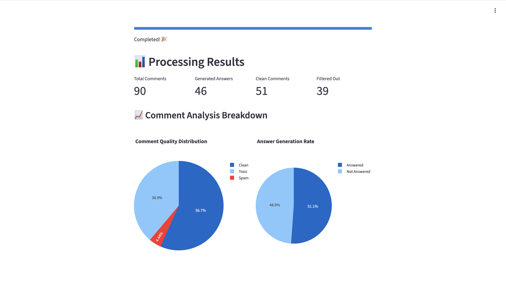
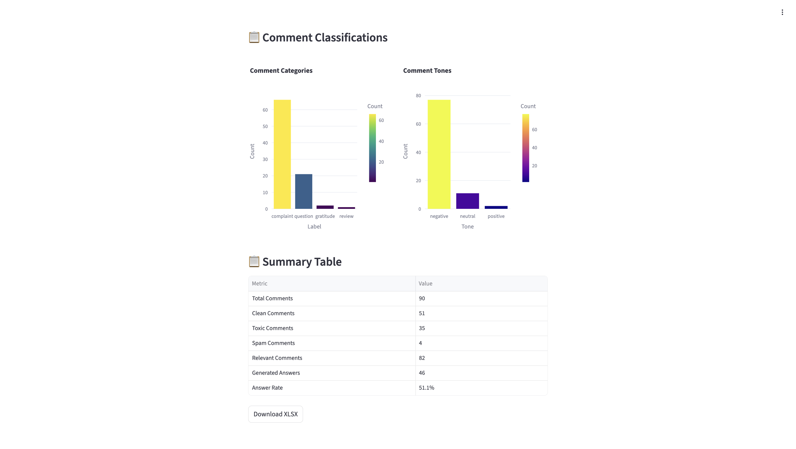
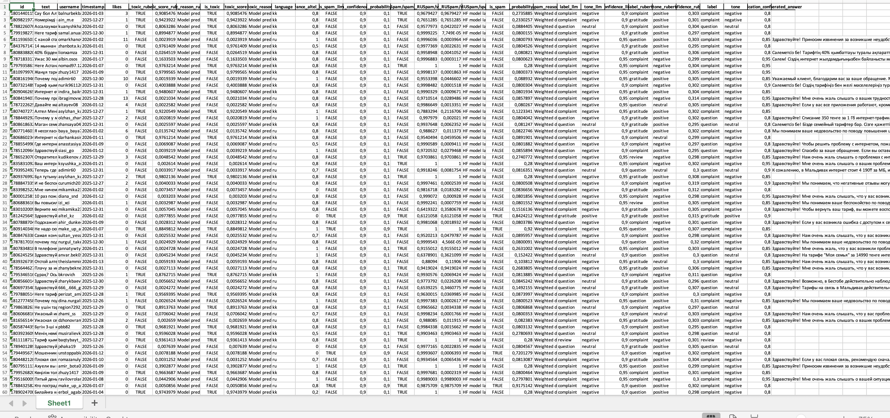

# Instagram Comment Responder

A Streamlit application with FastAPI backend for processing Instagram post comments and generating AI-powered responses.

## 📸 Screenshots

### Main Interface


The main interface allows you to process Instagram post comments by entering a post URL.

### Processing Results


After processing, you'll see comprehensive analytics including:
- Total comments processed vs. generated answers
- Comment quality distribution (Clean, Toxic, Spam)
- Answer generation success rate

### Detailed Analysis


The system provides detailed breakdowns of:
- Comment categories (complaint, question, gratitude, review)
- Comment tones (negative, neutral, positive)
- Summary statistics table

### Excel Report Output


All results are exported to a comprehensive Excel report containing:
- Original comments and generated responses
- Toxicity and spam detection results
- Comment classifications and confidence scores
- Processing metadata and timestamps

### Example Report

You can find a sample output report in the [`examples/answers.xlsx`](examples/answers.xlsx) file, which demonstrates the complete analysis of 90 Instagram comments with generated AI responses.

## ⚙️ Environment Setup

Before running the application, you need to configure environment variables:

1. **Copy the environment template**:
   ```bash
   cp env.example .env
   ```

2. **Edit the `.env` file** with your credentials:
   ```bash
   CLIENT_ID=""           # Instagram API client ID (optional for basic scraping)
   CLIENT_SECRET=""       # Instagram API client secret (optional for basic scraping)
   OPENAI_API_KEY=""      # Required: Your OpenAI API key for AI response generation
   PROJECT_ID=""          # Optional: Project identifier for tracking
   ```

### Environment Variables Explained

- **`OPENAI_API_KEY`** *(Required)*: Your OpenAI API key for generating AI responses. Get it from [OpenAI Platform](https://platform.openai.com/api-keys).
- **`CLIENT_ID`** *(Optional)*: Instagram API client ID. Only needed for advanced Instagram API features.
- **`CLIENT_SECRET`** *(Optional)*: Instagram API client secret. Only needed for advanced Instagram API features.
- **`PROJECT_ID`** *(Optional)*: Custom project identifier for organizing your data and tracking usage.

**Note**: The `OPENAI_API_KEY` is the only required variable for the application to work. The Instagram-related variables are optional and only needed for advanced API features.

## Features

- **Process All Comments**: Input an Instagram post URL, scrape all comments, generate AI responses, and download results as XLSX.
- **Process Single Comment**: Input a post URL and a specific comment, generate an AI response.

## 🐳 Docker Setup (Recommended)

### Quick Start with Docker Compose

1. **Clone the repository**:
   ```bash
   git clone <repository-url>
   cd datathon-altel-2025
   ```

2. **Run with Docker Compose**:
   ```bash
   docker-compose up --build
   ```

3. **Access the applications**:
   - **Streamlit UI**: http://localhost:8501
   - **FastAPI Backend**: http://localhost:8000
   - **API Documentation**: http://localhost:8000/docs

### Manual Docker Build

**Build and run FastAPI backend**:
```bash
docker build -f Dockerfile.fastapi -t instagram-comment-fastapi .
docker run -p 8000:8000 -v $(pwd)/data:/app/data instagram-comment-fastapi
```

**Build and run Streamlit frontend**:
```bash
docker build -f Dockerfile.streamlit -t instagram-comment-streamlit .
docker run -p 8501:8501 -e FASTAPI_URL=http://localhost:8000 instagram-comment-streamlit
```

## 🛠️ Local Development Setup

### FastAPI Backend

1. **Install dependencies**:
   ```bash
   pip install -r requirements.txt
   ```

2. **Run the FastAPI backend**:
   ```bash
   python run_server.py
   ```
   Or manually:
   ```bash
   uvicorn main:app --reload
   ```

### Streamlit Frontend

1. **Install dependencies**:
   ```bash
   pip install -r requirements-streamlit.txt
   ```

2. **Run the Streamlit app**:
   ```bash
   streamlit run app.py
   ```

## 🧪 Testing

To test the progress tracking, you can use:
```bash
python test_progress.py
```

## Usage

- For processing all comments: Enter the Instagram post URL and click "Process". Monitor the progress bar.
- For single comment: Enter the URL and comment, then click "Generate Answer".

## Progress Tracking

The application now tracks progress through 4 main steps:
1. Toxicity Detection
2. Spam Detection  
3. Comment Classification
4. Answer Generation

Progress is updated in real-time and displayed in the Streamlit interface.

## 📁 Project Structure

```
├── app.py                      # Streamlit frontend
├── main.py                     # FastAPI backend
├── requirements.txt            # Backend dependencies
├── requirements-streamlit.txt  # Frontend dependencies
├── Dockerfile.fastapi          # FastAPI Docker image
├── Dockerfile.streamlit        # Streamlit Docker image
├── docker-compose.yml          # Orchestration
├── models/                     # AI pipeline modules
├── api/                        # API utilities
├── detects/                    # Detection modules
├── classifiers/                # Classification modules
└── data/                       # Data storage
```

## 🚀 Production Deployment

For production deployment, consider:

1. **Environment Variables**: Set proper environment variables
2. **Secrets Management**: Secure API keys and credentials
3. **Resource Limits**: Configure appropriate CPU/memory limits
4. **Persistent Storage**: Mount volumes for data persistence
5. **Load Balancing**: Use reverse proxy for scaling

## Notes

- Instagram scraping may require login for private posts.
- The AI model uses GPT-4o-mini for response generation.
- Ensure both servers are running for the app to work.
- Check the FastAPI logs for detailed processing information.

## 🐛 Troubleshooting

- **Port conflicts**: Change ports in docker-compose.yml if needed
- **Memory issues**: Increase Docker memory limits for ML models
- **Network issues**: Ensure containers can communicate via the bridge network# datathon-activ-2025
